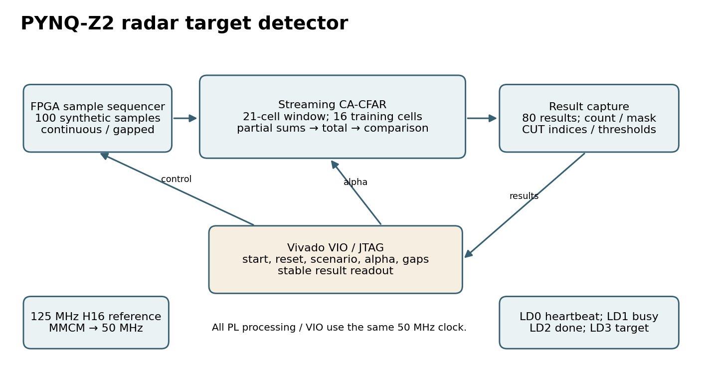

# Experiment 2 - Reconfigurable FPGA radar target detector

**Official project title:** Design and Implementation of a Reconfigurable FPGA-Based Architecture for Real-Time Radar Signal Processing and Intelligent Target Detection.

**Team:** Beyond Boolean. Shanshank Pulipati (25BEC0573); Kartik Yadav (25BEC0087).

**Board:** PYNQ-Z2, `xc7z020clg400-1`. **Clock:** 50 MHz. **Vivado:** 2025.1.1.

The FPGA generates 100 synthetic unsigned magnitude samples, applies a streaming 21-cell CA-CFAR detector, and retains results for Vivado VIO/JTAG readout. The threshold factor can change between frames without another bitstream. This implements a radar detection processing stage; RF acquisition, ADC, FFT, trained ML and partial FPGA reconfiguration are future extensions.

## Start here

- [Project report: all seven organizer sections](Documentation/Project2_Radar_Report.pdf)
- [Simulation report](Simulation/simulation_report.pdf)
- [Organizer checklist and remaining inputs](Documentation/SUBMISSION_READINESS.md)
- [Original physical PASS result](Results/HARDWARE_PASS.txt) and [39-row board CSV](Results/hardware_results.csv)
- [Successful Vivado log](Evidence/vivado_build.log) and [source/timing manifest](Results/BUILD_SUCCESS.txt)

The successful build and physical runs were performed on **8 October 2026 (IST)**. This upload preserves those results; it does not claim a new board run. All eleven RTL/testbench/Vivado files match the successful build's exact byte counts and CRC32 values. The original BIT/LTX bytes are unchanged.

| Verified result | Evidence |
| --- | --- |
| Core simulation: 10,721 results, 12,963 accepted samples | Icarus transcript and original Vivado XSim log |
| Controller simulation: 32 combinations plus repeated standard frame | 33 frame checks, held-start and active-reset checks in testbench |
| Physical verification | Complete 32-combination sweep plus repeat; 39 saved passing CSV rows including extra demonstration runs |
| Standard targets | Exactly three at CUT indices 30, 60 and 85; 80 complete windows |
| Continuous / gapped frame | 104 / 302 cycles; 2.08 / 6.04 microseconds at 50 MHz, excluding host/JTAG time |
| Routed setup / hold / pulse-width slack | WNS 12.176 ns; WHS 0.018 ns; WPWS 2.000 ns |
| Bitstream | Original `Hardware/radar_top.bit`, matching `radar_top.ltx` |

## Detector and RTL

The chronological window contains eight training cells, two guards, the CUT, two guards and eight training cells. The detector computes `floor(training_sum / 16) * alpha`, with alpha 1, 2, 4 or 8. It detects strictly when the CUT is greater than the **19-bit full threshold**. Only the 16-bit display saturates. Stalls do not advance the window; reset clears pending results. A 100-sample frame produces CUT indices 10 through 89 without boundary padding.

`radar_top` contains clock buffers/MMCM, startup reset, VIO, LEDs and `radar_demo`; `radar_demo` contains `cfar_core`. The MMCM converts the H16 125 MHz reference to 50 MHz. The core has partial-sum, total-sum and comparison register stages. All detector, controller and VIO logic use the same 50 MHz clock. LD0 is heartbeat, LD1 busy, LD2 done and LD3 at least one target. Busy lasts microseconds and is better observed through VIO than by eye.



The [RTL schematic](Images/rtl_schematic.svg) is genuinely generated by Yosys from these sources. Vendor clock primitives and the proprietary VIO are library declarations/black boxes in that structural check. It is not a Vivado GUI capture or a new timing result. The DOT, trimmed used-module netlist and full tool transcript are included.

## Files required by the organizer

| Folder / file | Contents |
| --- | --- |
| `Documentation/` | Seven-section project PDF, readiness audit and narration guide |
| `RTL/` | Three original Verilog modules and original PYNQ-Z2 XDC |
| `Testbench/` | Original core and controller SystemVerilog testbenches |
| `Simulation/` | Waveform PNG, actual VCDs/CSV, transcript, simulation PDF and structural schematic evidence |
| `Images/` | Block diagram, source-elaborated schematic, real board photo, real hardware-output photo and console capture |
| `Hardware/` | Original matching BIT/LTX programming files |
| `Vivado/`, `Tools/`, launchers | Reproducible project creation, programming and automated verification |
| `Results/`, `Evidence/` | Supplied build/PASS/CSV results, full successful Vivado log, evidence provenance |
| `FPGA_Project/` | Original successful native `.xpr`, VIO IP configuration/generated files and source archive; opening/reproduction instructions |
| `Reports/` | Eight original routed reports, routed checkpoint and warning review |
| `Video_Link.txt` | **Zero bytes, intentionally blank as requested** |

## Use the existing hardware files

No rebuild is needed to program the included successfully tested BIT/LTX. Keep the board's normal working power/boot setup, let PYNQ boot, connect USB/JTAG, and release the target from another Vivado instance. In Vivado's Tcl Console, set the folder path and run:

```tcl
set p2_dir {C:/FPGA_Projects/Experiment-2-Beginner}
source [file join $p2_dir Vivado program_board.tcl]
source [file join $p2_dir Vivado hardware_test.tcl]
```

The script checks the `RAD2` design identifier, tests exact counts, positions, full detection masks, thresholds, cycle counts, result counts and retained configuration, and saves fresh results. Make a copy first if you want to preserve the archived `Results/` evidence.

```tcl
radar_run_case 0 4       ;# noise only: 0 targets
radar_run_case 1 4       ;# three targets: 30,60,85
radar_run_case 2 4       ;# weak target rejected
radar_run_case 2 2       ;# weak target detected at 30
radar_run_case 1 4 1     ;# same three targets with input gaps
radar_run_case 3 4       ;# full-width threshold rejects overflow case
radar_reset
```

For a clean reproduction, clone/download this folder to a path **without spaces**, run `RUN_PROJECT2.cmd`, then use `OPEN_PROJECT2.cmd` to open the newly generated `.xpr`. Building creates a timestamped `Build/` project and records its path in `Results/project_path.txt`. **The build clears old result markers and hardware outputs before creating new ones**, so reproduce in a separate copy. The recovered original `.xpr` is supplied inside `FPGA_Project/Project2_Radar_Vivado_Source.zip`; extract the whole archive and open its successful project directly. The root launcher opens a newly reproduced build. See `FPGA_Project/README.md`.

To audit the archived identity/results without a board: `python Tools/validate_evidence.py`. To regenerate the scientific plots: install matplotlib and run `python Tools/generate_figures.py`. To regenerate the PDFs: install reportlab and Pillow and run `python Tools/generate_reports.py`.

## Remaining work

Project 2 is **not yet 100% submission-complete**: the final narrated demo URL is intentionally blank and the final video must cover the organizer's presentation requirements. The original routed reports/checkpoint and generated `.xpr`/IP source archive are now supplied. All four bus-skew constraints pass, with minimum slack 19.034 ns, and there are zero unconstrained internal endpoints. Routed utilization is 2010 LUTs, 3329 FF, zero BRAM and zero DSP, including VIO/debug hub. DRC has five Warning checks and methodology four; their origins and deployment considerations are documented in `Reports/README.md`. All required Project 2 technical-document categories are complete.

The existing Projects 3/4/5 are preserved. Repository-wide work also includes Experiment 1, the combined final team PDF, and checking the organizer's repository naming convention.

## Primary technical references

- [AMD/Xilinx PYNQ-Z2 reference XDC](https://github.com/Xilinx/xup_fpga_vivado_flow/blob/main/source/pynq-z2/lab5/uart_led_pins_pynq.xdc)
- [AMD MMCME2_BASE](https://docs.amd.com/r/2022.2-English/ug953-vivado-7series-libraries/MMCME2_BASE)
- [AMD VIO commit](https://docs.amd.com/r/2023.2-English/ug835-vivado-tcl-commands/commit_hw_vio) and [refresh](https://docs.amd.com/r/2021.2-English/ug835-vivado-tcl-commands/refresh_hw_vio)

